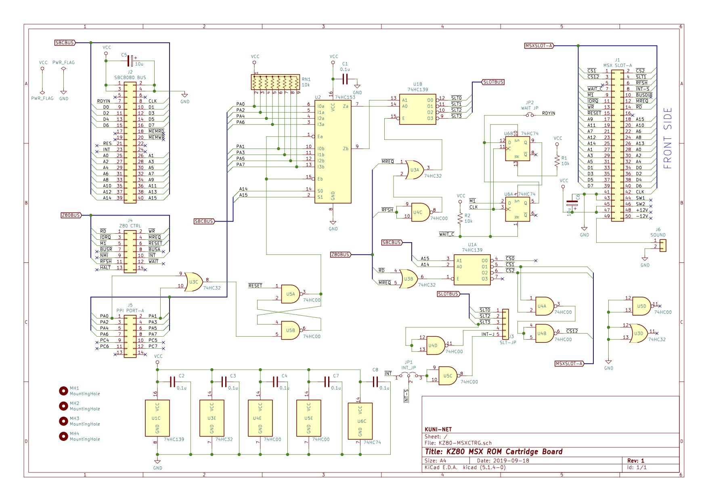

== KZ80シリーズ MSX カートリッジスロットボード

=== 概要
* SBC8080バスなどに接続する MSX ROMカセット カートリッジスロットボードですです。試作段階です。

=== ライセンス
* 本プロジェクトのデータはMITライセンスのもとで公開します。

=== 参考
* http://ngs.no.coocan.jp/doc/wiki.cgi/datapack?page=7%BE%CF+MSX2%2B%B2%F3%CF%A9%CE%E3